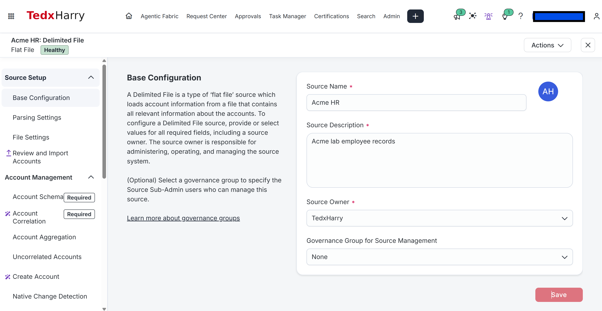
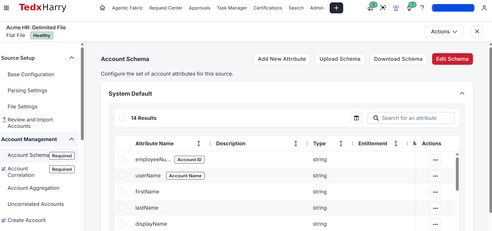
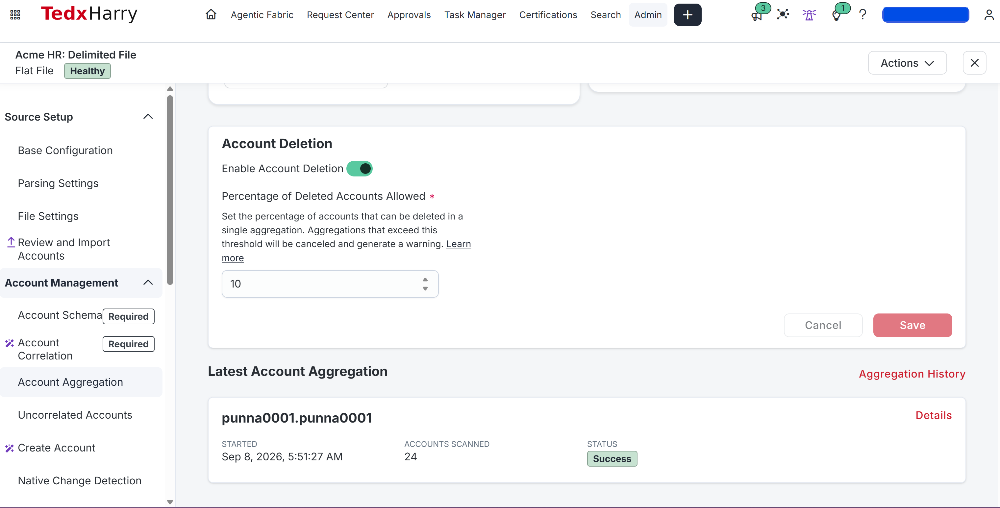
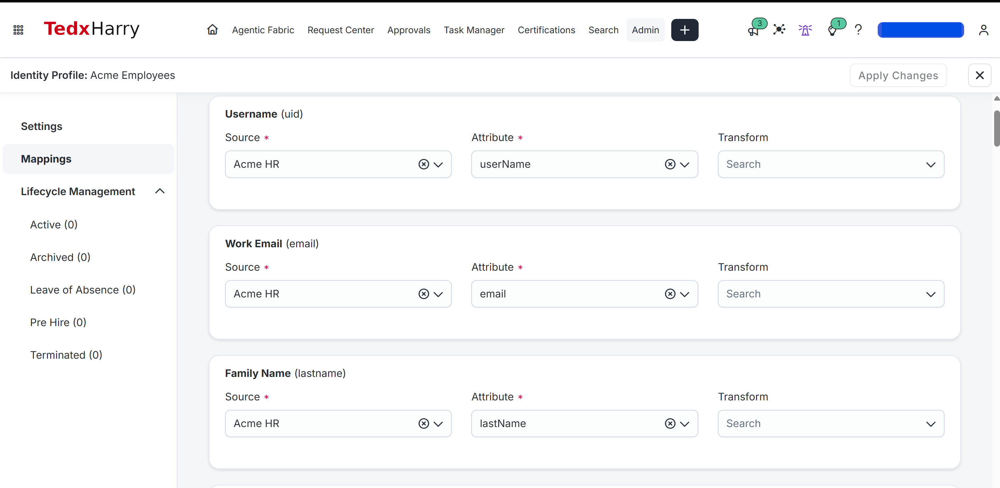
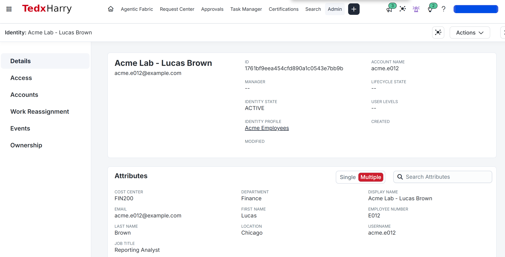

# AR-001 — Import Acme's HR Records

**Level:** Beginner

**Prerequisites:** Sign in to your ISC training tenant with an account that can create sources and identity profiles. Your existing AD connection will be used in later labs; this exercise imports HR data.

## Before you open the settings

Use your ISC administrator session. Keep the downloaded HR CSV and a private working copy beside you. You do not need an employee login yet.

On your first attempt, Acme HR and Acme Employees do not exist. If either exists, open it and compare its configuration with this lab before creating anything.

No HR file from another lab should be uploaded here. Begin with the 24-row Acme file; keep any controlled email addresses you already added.

## What you’ll do

Start with the employee file. You’ll bring its 24 records into ISC, check the identities it produces, then change Lucas’s department and follow that change through the records. This gives you a way to locate a data problem before you configure access requests.

## Lab files

- [HR baseline CSV](../../datasets/acme-hr-baseline.csv)
- [Evidence journal](EVIDENCE.md)
- [Company and environment reference](../../LAB-ENVIRONMENT.md)

1. Open the **HR baseline CSV** link and select **Download raw file** on GitHub.
2. Save it as `acme-hr-baseline.csv`.
3. Make a copy named `acme-hr-working.csv`. Use this working copy for every upload below.
4. Open the working copy in a text editor or a spreadsheet application. If using a spreadsheet application, save it as **CSV UTF-8 (Comma delimited)**, not an Excel workbook.

**Check:** The downloaded file begins with `employeeNumber,userName,firstName`. If it contains webpage markup, download the raw CSV again.

## Starting state

Your tenant and AD connection are already available. Use a new **Acme HR** Delimited File source for this lab.

Open **Admin > Identity Management > Identities** and search for `acme.e001` and `Acme Lab`. The intended starting state is a new Acme population with usernames `acme.e001` through `acme.e024` available. If you already started this lab, use the same **Acme HR** source and **Acme Employees** profile, and resume at the first unfinished check. Do not create another copy of either object.

Review existing automatic role criteria and identity-triggered workflows for rules that could include newly created lab employees. Use a training configuration that keeps these test identities outside unrelated automation.

## What you will finish with

| Item | Name or result |
|---|---|
| HR source | Acme HR |
| HR accounts | 24 |
| Identity profile | Acme Employees |
| Acme identities | 24 |
| Sample identity | acme.e012 — Acme Lab - Lucas Brown |
| Lucas's final department | Finance |

Complete the sections in order. At each **Check**, confirm the result before continuing. If a check fails, use the troubleshooting section rather than repeating source or profile creation.

## Before you configure anything

There are two records to inspect: the imported **HR account** and the resulting **ISC identity**. The source schema describes the CSV fields; identity-profile mappings choose which of those values populate the identity.

An identity profile makes the HR source authoritative. The file's `managerEmployeeNumber` is raw HR data; resolving it to an ISC manager is AR-002. [Identity profiles](https://documentation.sailpoint.com/saas/help/setup/identity_profiles.html)

Write down your prediction:

- How many HR accounts should the file create?
- How many Acme identities should you find?
- Where should Lucas Brown's department appear?
- What would distinguish an import problem from an identity-mapping problem?

## 1. Inspect the HR file

The file contains **24 employees and 14 columns**. Identifiers remain text, including the leading zeros in `E001` and `acme.e001`.

| Column | Example | Purpose |
|---|---|---|
| employeeNumber | E012 | Stable HR account identifier |
| userName | acme.e012 | Distinct Acme account and identity username |
| firstName | Lucas | Given name |
| lastName | Brown | Family name |
| displayName | Acme Lab - Lucas Brown | Recognizable training identity label |
| email | acme.e012@example.com | Placeholder email |
| department | Finance | Department used in later request scenarios |
| title | Reporting Analyst | Job title |
| managerEmployeeNumber | E003 | HR manager reference |
| location | Chicago | Work location |
| employeeType | Employee | Worker classification |
| costCenter | FIN200 | Department cost center |
| status | active | HR status text |
| startDate | 2025-01-06 | HR start date in YYYY-MM-DD format |

The `example.com` addresses are placeholders. They can remain for this import exercise; use controlled test mailboxes before invitation and email-notification labs. If you customize them now, retain that personalized baseline for recovery.

Keep the comma delimiter, exact column names, and all 24 rows. Save edited files as UTF-8 CSV. Morgan Reed (`E001`) is the hierarchy root and has an empty manager field.

## 2. Create the HR source

1. Open **Admin > Connections > Sources > Create New**.
2. Find **Delimited File** and choose **Configure** or **Actions > Standard Setup**.
3. Name the source **Acme HR** and describe it as `Acme lab employee records`.
4. Select your existing administrator as owner; the Acme identities do not exist yet.
5. Choose the file-based connection option if prompted. If this setup screen offers **Authoritative Source**, select it; creating Acme Employees with Acme HR in Section 5 establishes the authoritative identity-profile relationship.
6. Continue and save the source configuration. Leave **Enable Provisioning** off for this HR feed.

**Check:** Reopen **Admin > Connections > Sources** and confirm **Acme HR** appears as a **Delimited File** source. Record its name in your journal. [Source configuration](https://documentation.sailpoint.com/saas/help/sources/config_sources.html)

*HR source: Base Configuration shows Acme HR, the lab description, and a selected source owner. Choose your own administrator as owner; TedxHarry is the owner in this example.*

**Screenshot reminder:** Capture the saved Acme HR source name and type.

## 3. Define the account schema

1. In **Acme HR**, open **Account Management > Account Schema**.
2. Use **Upload Schema** with `acme-hr-working.csv` if that control is available. This imports the column definitions. Otherwise, use **+ Add New Attribute** to add each missing name from the 14-column table in Section 1; reuse names already present.
3. For the CSV attributes, use **String** as the type. Leave **Multi-Valued** and **Entitlement** unchecked. Keep `startDate` and `status` as strings too.
4. Select **Edit Schema** and choose the following values, then select **Update**:

| Setting | Select |
|---|---|
| Account ID | employeeNumber |
| Account Name | userName |

5. Compare the schema with the CSV header. On this new, unaggregated source, remove unused default attributes through **Actions > Delete**. Keep all 14 CSV attributes, including `location`. If deletion is blocked by a referenced configuration, preserve the error details and resolve the source-specific reference before importing; do not remove configurations elsewhere in the tenant to force this step.

**Check:** All 14 CSV columns exist in the schema with their exact spelling. `employeeNumber` is marked Account ID, and `userName` is marked Account Name. Capture this screen.

*Account schema: 14 attributes are listed. The identifying fields have Account ID and Account Name badges. Scroll through the remaining rows to check all attributes; the screenshot shows only the top portion of the list.*

Set the identifying attributes before importing accounts; changing them afterward can disrupt account references. [Account schemas](https://documentation.sailpoint.com/saas/help/accounts/schema.html)

The supplied header is a custom HR schema. Delimited File defaults such as `id`, `name`, `givenName`, and `e-mail` are not the column names in this file. Uploading a replacement schema retains existing settings for matching attributes, so verify their types and flags after upload. [Delimited File account attributes](https://documentation.sailpoint.com/connectors/delimited_file/help/integrating_delimited_file/account_attributes.html)

### Confirm the file will parse as columns

Confirm the saved file is comma-delimited UTF-8 CSV with the exact 14-column header and 24 employee rows. If the source exposes **Parsing Settings**, select Delimited. In **File Settings**, edit the account file configuration and verify a comma delimiter. Keep unrelated settings unchanged; this manual upload does not need a remote file path.

If a preview is offered, employeeNumber, userName and department must appear in separate columns. A whole row in one attribute indicates a parsing mismatch. After upload, inspect E012’s stored account to prove the file parsed correctly. [Delimited parsing](https://documentation.sailpoint.com/connectors/saas/delimited_file/help/saas_connectivity/delimited_file/parsing_settings.html)

**Screenshot reminder:** Capture the schema with Account ID and Account Name visible.

## 4. Import the accounts

1. Open **Acme HR > Account Management > Account Aggregation**.
2. Select the upload control and choose `acme-hr-working.csv`.
3. Complete any upload confirmation. Check the latest aggregation result on that page until the operation finishes; investigate any error before continuing.
4. Open **Acme HR > Account Management > Accounts**. Clear any Correlated/Uncorrelated filter and verify the total is **24**. Check all pages or use **Export** to count the records if necessary.
5. Find the account named **acme.e012** and open it. Confirm its Account ID is `E012`, `department` is `Finance`, and `costCenter` is `FIN200`.

**Check:** You can open Lucas's imported HR account and read its values. Identity verification comes after profile setup. [Viewing source accounts](https://documentation.sailpoint.com/saas/help/sources/index.html#viewing-accounts-on-a-source)

*Account import: Latest Account Aggregation shows **Accounts Scanned: 24** and **Status: Success**. Verify the stored account count and Lucas's account separately as described above.*

**Note:** The same screen shows Account Deletion enabled with a 10% threshold. These are the example tenant's settings, not settings to copy for this lab. Keep all 24 records in each upload; the department exercise does not require account deletion.

Uploading a schema and aggregating accounts are separate operations. Account data must be loaded after the schema is defined. [Delimited File data import](https://documentation.sailpoint.com/connectors/delimited_file/help/integrating_delimited_file/data_import.html)

Use the uploaded filename and aggregation result to confirm which file was processed. **Aggregate Using Latest File** reuses the previously uploaded file; it does not read edits from your computer. [Loading account data](https://documentation.sailpoint.com/saas/help/accounts/loading_data.html)

**Screenshot reminder:** Capture the completed import and scanned account count.

## 5. Create the identity profile

1. After aggregation completes, open **Admin > Identity Management > Identity Profiles > Create New**.
2. Enter **Acme Employees** as the name and **Acme HR** as the source. Leave automatic invitations off and save.
3. Open **Mappings** and configure the table below. For each row, select **Acme HR** under **Source**, then the listed field under **Attribute**. Use direct mappings without a transform.
4. Select **Save**. If **Preview** offers an Acme identity, verify its values before applying. If none is available yet, continue to Section 5a and preview afterward.

User Name must be unique tenant-wide. User Name, Work Email, and Last Name must have nonempty mappings. [Required mappings and profile setup](https://documentation.sailpoint.com/saas/help/setup/identity_profiles.html)

| Identity attribute | HR source attribute |
|---|---|
| User Name (`uid`) | userName |
| First Name (`firstname`) | firstName |
| Last Name / Family Name (`lastname`) | lastName |
| Display Name (`displayName`) | displayName |
| Work Email (`email`) | email |
| Identification Number (`identificationNumber`) | employeeNumber |
| Department (`department`) | department |
| Title (`title`) | title |
| Location (`location`) | location |
| Cost Center (`costCenter`) | costCenter |

Keep `managerEmployeeNumber`, `employeeType`, `status`, and `startDate` on the HR account for now. The CSV value `active` is HR text; do not map it to Lifecycle State or enable lifecycle provisioning in this exercise.

**Check:** Reopen **Mappings** and confirm all ten mappings were saved. Pay attention to the difference between identity `firstname` and CSV `firstName`, and between identity `uid` and CSV `userName`.

*Identity mappings: the three visible mappings use Acme HR and have no transform selected. This screen labels `lastname` as **Family Name**. Continue through the page to configure the other seven mappings in the table.*

### 5a. Apply the mappings and check processing

1. In **Acme Employees**, select **Apply Changes**. This applies the saved profile configuration to its identities.
2. Open **Admin > Dashboard > Monitor** and inspect **Active Jobs** while identity processing runs.
3. Return to **Admin > Identity Management > Identity Profiles**. If the profile still reports **Needs Processing**, check the job outcome before starting another job.
4. If **Identity Exceptions** are present, download the report from the profile list. Investigate missing required values or duplicate usernames before continuing.

Changes to imported account data normally initiate identity processing automatically. Saving a profile mapping and applying it are separate actions. [Identity processing](https://documentation.sailpoint.com/saas/help/setup/identity_processing.html)

**Screenshot reminder:** Capture the saved identity mappings; use several images to show all fields.

## 6. Verify the identities

1. Open **Acme HR > Aggregation History and Connections > Connections**. Under **Identity Profile**, verify the linked profile is **Acme Employees** and check its identity count. [Source connections](https://documentation.sailpoint.com/saas/help/sources/index.html#removing-identity-profiles-from-a-source)
2. Open **Admin > Identity Management > Identities**, locate `acme.e012`, and open its details.
3. Check Lucas's identity attributes against the expected values below.
4. Select **Accounts**, open the **Acme HR** account, and compare its raw attributes with those identity values.
5. Repeat the sample checks for `acme.e001`, `acme.e018`, and `acme.e023`.

Count the identities linked to this profile, not the total number of identities in the tenant. If the count differs from 24, investigate the account list and profile exceptions rather than treating the import as complete.

| Check | Expected result |
|---|---|
| HR accounts on Acme HR | 24 |
| Identities associated with Acme Employees | 24 |
| Identification numbers | E001 through E024, each represented once |
| Usernames | acme.e001 through acme.e024, each represented once |
| E001 | Acme Lab - Morgan Reed; IT; IT100 |
| E012 | Acme Lab - Lucas Brown; Finance; FIN200 |
| E018 | Acme Lab - Henry Anderson; Engineering; ENG500 |
| E023 | Acme Lab - Abigail Lewis; Security; SEC600 |

Department counts should be IT **6**, Finance **4**, HR **3**, Sales **3**, Engineering **4**, and Security **4**.

Capture both Lucas's HR account and identity attributes. A successful aggregation alone is not the complete verification.

**Check:** Lucas has one Acme identity, with Department `Finance`, Identification Number `E012`, and its corresponding Acme HR account. Manager resolution and AD account membership are not completion requirements for this lab.

*Baseline identity: Display Name is **Acme Lab - Lucas Brown**, while Username remains **acme.e012**. The identity belongs to Acme Employees and shows Finance, FIN200, Chicago, and Reporting Analyst. The employee identifier appears under **Employee Number** in this tenant. Open **Accounts** to capture and compare the Acme HR account as well.*

**Check:** The displayed name matches the baseline CSV. Manager is still blank; resolve that relationship in [AR-002](../AR-002/README.md).

**Screenshot reminder:** Capture Lucas’s HR account and identity with Department Finance.

## 7. Practice challenge: investigate a wrong department

HR reports that Lucas Brown belongs in Finance, but ISC displays Sales.

### Introduce the problem

1. Open `acme-hr-working.csv` and locate the row whose first field is `E012`.
2. Change only that row's `department` value from `Finance` to `Sales`. Leave its identifiers, cost center, and other fields unchanged.
3. Save the CSV. Reopen it to confirm the change is present and all 24 rows remain.
4. Open **Acme HR > Account Management > Account Aggregation** and upload the edited file using the upload control.
5. Once aggregation finishes, open **Account Management > Accounts > acme.e012** and record the department.
6. Open **Admin > Identity Management > Identities**, locate `acme.e012`, and record its identity Department after processing.

**Check:** For this deliberately incorrect input, both values should become `Sales`; the employee and account counts should remain 24. If only the HR account changed, follow the processing checks below.

### Investigate

- What department is in the exact file you uploaded?
- Did the latest aggregation process that file successfully?
- What is stored on Lucas's HR account?
- Which source and attribute supply his identity Department?
- Do the account and identity disagree, or do both agree with the incorrect file?

Explain which layer needs correction before applying a fix. If the identity has not updated, distinguish pending processing from an incorrect mapping.

### If the account changed but the identity did not

1. Confirm that identity Department maps to **Acme HR > department**.
2. If you correct the mapping, **Save** and **Apply Changes** on **Acme Employees**.
3. Check **Admin > Dashboard > Monitor** for active processing. Reopen the identity after the job completes.
4. If the correct mapping is applied, processing is no longer running, and Lucas still shows the old value, find him on **Admin > Identity Management > Identities** and use **Actions > Process Identity**. Recheck the job and values. Record any error rather than repeatedly resubmitting the job. [Processing selected identities](https://documentation.sailpoint.com/saas/help/setup/identity_processing.html#manually-processing-for-select-identities)

Hint: compare three values

Compare `E012`'s CSV department, Acme HR account department, and identity Department in that order. The first point of disagreement tells you where to investigate next.

### Restore and prove the correction

1. Change `E012`'s department back to `Finance` in the working file and save it.
2. Upload that complete 24-row file again through **Acme HR > Account Management > Account Aggregation**.
3. Verify the finished aggregation, then confirm `Finance` on the HR account and the identity.
4. Compare Lucas's account and identity identifiers with your baseline evidence. They should still identify the same records.
5. Retain the corrected working file. Keep your customized mailboxes if you changed them earlier.

Your final result must show Finance in both records, 24 HR accounts, and no additional Lucas identity. Retain `FIN200` as his cost center throughout the exercise.

| Stage | E012 CSV department | HR account department | Identity Department |
|---|---|---|---|
| Baseline | Finance | Finance | Finance |
| After introducing the problem and processing | Sales | Sales | Sales |
| After correction and processing | Finance | Finance | Finance |

**Screenshot reminder:** Capture Sales on the HR account and identity during the exercise, then Finance on both after restoration.

## If the result doesn’t match

| Symptom | Investigate |
|---|---|
| Import rejects the file | Actual CSV format, delimiter, headers, and source schema |
| One field is empty on every HR account | Spelling and case of that column and schema attribute |
| Accounts exist but identities are missing | Verify Acme Employees uses Acme HR, check the ten mappings, apply changes, and inspect the identity-exception report |
| An existing identity received the HR account | Source correlation and other authoritative profiles; do not create another profile to hide the conflict |
| HR department is correct but identity Department is wrong | Mapping source/attribute, applied changes, and processing state |
| The old value remains after reimport | Uploaded filename, account value, and whether the old latest file was reused |
| More than one record appears for an employee | Stable Account ID/Name and existing correlation; preserve identifiers while investigating |

## Your ticket: Lucas still shows Sales after the file was corrected.

The supplied case says the learner edited a local file, selected Aggregate Using Latest File, and then found Sales on both the HR account and identity.

Inspect your own import controls and identify how you would upload the edited file. Write the first stored value you would check and the result needed to close the ticket. Do not change a working identity merely to reproduce this case.

Write your diagnosis and the evidence you would accept before opening the solution. If you use the supplied case, label it a ticket exercise; do not record it as a tenant failure you observed.

Compare your diagnosis with the mentor’s solution

The stored latest file can still be the earlier upload. Upload the corrected complete working CSV, inspect E012 on Acme HR, then check the identity after processing. If HR says Finance but the identity still says Sales, inspect the mapping and processing instead. Close only when both are Finance and no account/identity was duplicated.

## If you stopped midway or want to repeat this lab

If an upload stopped, inspect the latest aggregation before uploading again. If accounts exist but identities do not, resume at profile mappings and processing. For a repeat, reuse the same source/profile and complete working file. Restore Lucas to Finance after the department exercise; keep source, profile, identities and the corrected file. After later labs add employees, preserve those rows and record the actual population instead of reimporting the original 24-row file.

## What you should leave in place

| Item | State before you continue |
|---|---|
| Acme HR / Acme Employees | Keep both; 24 HR accounts and identities on the first pass |
| Lucas | Department Finance; same identifiers as before the practice |
| AD | This import has not created an AD user |

## Completion checklist

- [ ] The practice/comparison and your ticket diagnosis are recorded in the journal.
- [ ] Any temporary change is restored and the retained state matches the next lab.
- [ ] Acme HR contains all 24 employee accounts.
- [ ] Acme Employees has the expected Acme identity population and required mappings.
- [ ] Sample identity values match the corresponding HR accounts.
- [ ] Lucas's department is restored to Finance without duplicate records.
- [ ] The unchanged or personalized baseline CSV is retained.
- [ ] Your journal contains the evidence and your explanation of the fault.

## Screenshots to retain

| Screenshot | What it should show |
|---|---|
| HR source | Acme HR and Delimited File source type |
| Account schema | CSV attributes and Account ID/Name selections |
| Account import | Finished aggregation and account count |
| Identity mappings | Acme HR selected for the mapped fields |
| Baseline | Lucas's HR account and identity showing Finance |
| Incident | Both records showing Sales |
| Recovery | Both records showing Finance again |

Use captions identifying the lab section and the result. Hide credentials and unrelated personal information.

Keep **Acme HR** and **Acme Employees** for [AR-002 — Resolve the Manager Hierarchy](../AR-002/README.md). Its starting requirement is the verified HR baseline; the department-change exercise can be revisited separately. AD account correlation is covered in AR-004.

[Return to the course outline](../../README.md)
