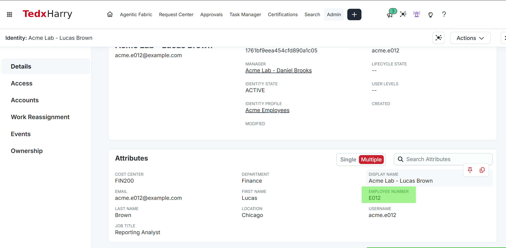
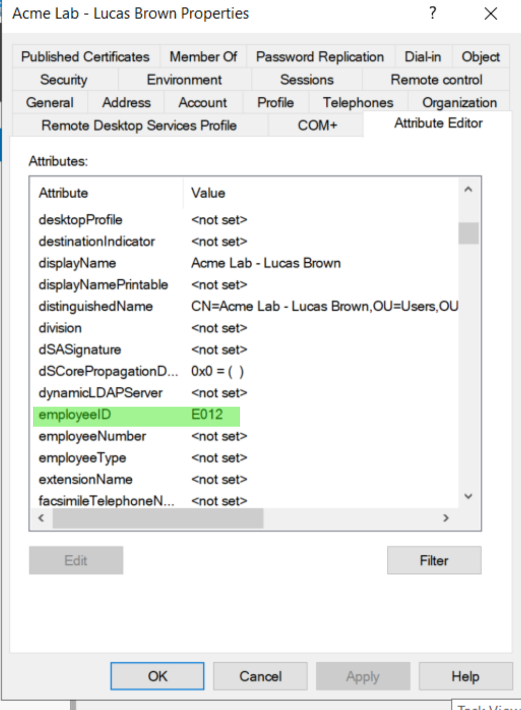
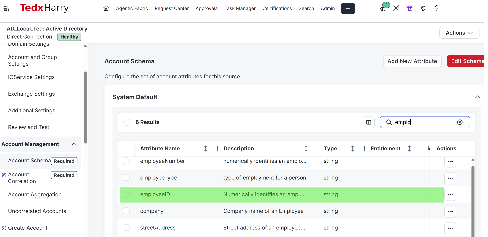
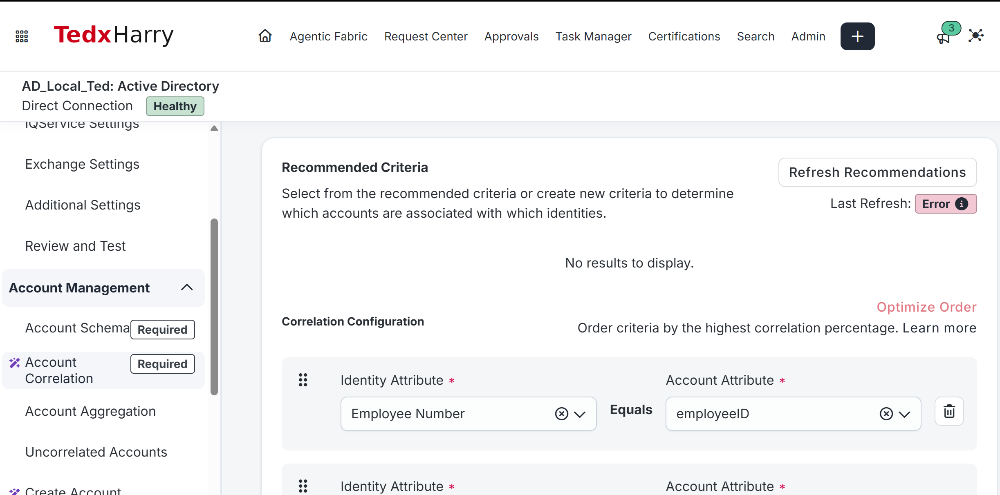
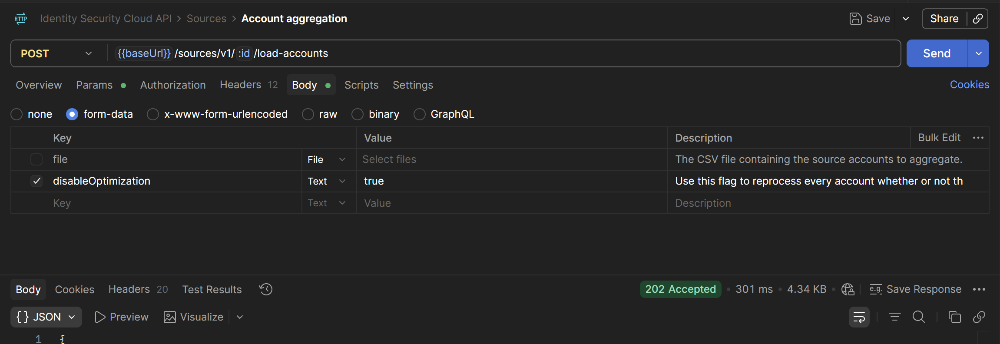
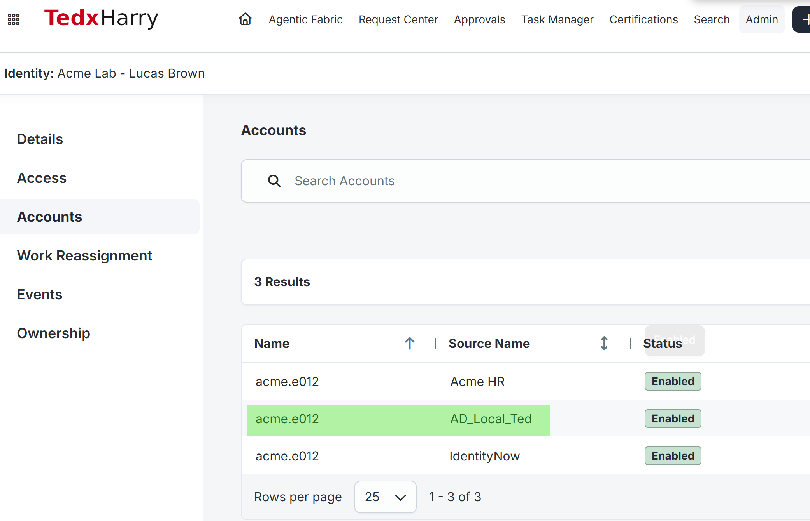

# AR-004 — Correlate Lucas's Existing AD Account

**Level:** Beginner

## Goal

Correlate Lucas Brown's existing Active Directory account to his ISC identity by matching the same employee identifier on both records.

Use the [Module 1 configuration record](../../M01-STATE.md) for actual environment values and the required retained state.

## Session for this lab

Use your ISC administrator session for ISC steps and your AD administration workstation for directory steps.

## Prerequisites

Complete [AR-003](../AR-003/README.md).

You should already have:

- Lucas Brown as ISC identity `acme.e012`.
- Lucas's AD account imported on the AD source.
- `identificationNumber = E012` on Lucas's ISC identity.
- The AD source ID and Lucas's AD distinguishedName recorded.

Keep your [evidence journal](EVIDENCE.md) open.

## What you will finish with

| Item | Expected result |
|---|---|
| ISC identity attribute | `identificationNumber = E012` |
| AD account attribute | `employeeID = E012` |
| Correlation pair | `identificationNumber` = `employeeID` |
| Lucas AD account | Linked to `acme.e012` |

---

## 1. Verify Lucas's ISC identifier

1. Open **Admin > Identity Management > Identity Profiles > Acme Employees > Mappings**.
2. Confirm **Employee Number (`identificationNumber`)** maps to **Acme HR > employeeNumber**.
3. Open **Admin > Identity Management > Identities**.
4. Search for `acme.e012` and open Lucas Brown.
5. Confirm **Employee Number = E012**.

**Check:** Lucas's ISC identity contains `E012` in Employee Number.

**Screenshot:** Save `AR-004-01-identity-number.png`. Capture Lucas's Employee Number.



Lucas has Employee Number E012 on his ISC identity. In profile mappings, this field has technical name identificationNumber.

## 2. Set employeeID on Lucas's AD account

1. Open **Active Directory Users and Computers**.
2. Select **View > Advanced Features**.
3. Open **AcmeLab > Users > Acme Lab - Lucas Brown**.
4. Open **Properties > Attribute Editor**.
5. Locate `employeeID`.
6. Set the value to `E012`.
7. Select **Apply** and reopen the attribute to confirm the saved value.
8. Record Lucas's `distinguishedName` and `sAMAccountName`.

Do not change the separate AD `employeeNumber` attribute.

**Check:** Lucas's AD account contains `employeeID = E012`.

**Screenshot:** Save `AR-004-02-ad-employee-id.png`. Capture `employeeID = E012` on the AD account.



Set AD employeeID to E012. The separate AD employeeNumber field is not used for this correlation and remains unset in this example.

## 3. Add employeeID to the AD account schema

1. Open **Admin > Connections > Sources > your AD source**.
2. Open **Account Management > Account Schema**.
3. Find `employeeID`.
4. If it is not present, select **Add New Attribute** and enter:

| Setting | Value |
|---|---|
| Name | employeeID |
| Type | String |
| Multi-Valued | No |
| Entitlement | No |

5. Save the schema.
6. Leave the existing Account ID and Account Name settings unchanged.

Reference: [Account schemas](https://documentation.sailpoint.com/saas/help/accounts/schema.html)

**Check:** `employeeID` is present in the AD account schema.

**Screenshot:** Save `AR-004-03-account-schema.png`. Capture `employeeID` in the account schema.



The AD account schema includes employeeID with type string. Check the remaining flags in its attribute settings before saving.

## 4. Configure account correlation

1. Open **Admin > Connections > Sources > your AD source > Account Management > Account Correlation**.
2. Record the current account-correlation configuration in your journal.
3. Configure the course correlation pair:

| Field | Value |
|---|---|
| Identity Attribute | Employee Number (`identificationNumber`) |
| Comparison shown between the fields | Equals (fixed; no operator dropdown) |
| Account Attribute | employeeID |

4. Place this criterion first. Review remaining criteria: they are alternative matches, not conditions that must all pass. Retain criteria appropriate for this source and record their order.
5. Save the configuration.
6. Leave **Manager Correlation** unchanged.

Reference: [Account correlation](https://documentation.sailpoint.com/saas/help/accounts/correlation.html)

The match is:

```text
Lucas ISC identity
identificationNumber = E012
           │
           └── matches ──> AD account employeeID = E012
```

**Check:** The saved correlation pair uses `identificationNumber` and `employeeID`.

**Screenshot:** Save `AR-004-04-correlation.png`. Capture the saved Account Correlation configuration.



The first criterion compares Employee Number with employeeID. The recommendation refresh shows Error; that is separate from the configured criterion. Save and reopen the criterion, inspect any lower fallback rows, and verify the aggregation result.

## 5. Run an unoptimized AD account aggregation

Use [AGGREGATION.md](AGGREGATION.md) to run an unoptimized AD account aggregation so the newly added `employeeID` schema attribute is read from the existing account.

The API procedure requires Postman and an authorized administrator API token. Use the recorded source ID, not the source name. Wait for the job to complete before continuing.

**Check:** The aggregation completes successfully and Lucas's imported AD account shows `employeeID = E012`.

**Screenshot:** Save `AR-004-05-aggregation.png`. Capture the Postman request and response. Also capture the completed job separately as `AR-004-07-aggregation-history.png`.



Postman submits disableOptimization=true and receives 202 Accepted. This confirms submission only. Check the completed job in Aggregation History before continuing.

If Lucas was already linked correctly, retain that link. Record that you verified the existing association; an unchanged link alone does not prove which criterion originally matched it.

## 6. Verify the account link

1. Open **Admin > Identity Management > Identities**.
2. Search for `acme.e012` and open Lucas Brown.
3. Open **Accounts**.
4. Find the account on your AD source.
5. Confirm:

| Check | Expected result |
|---|---|
| sAMAccountName | acme.e012 |
| employeeID | E012 |
| DN | Matches the AD account |
| Linked identity | Lucas Brown / acme.e012 |

6. Confirm Lucas still has his Acme HR account as well.
7. Confirm only one course AD account is linked to Lucas.

**Check:** Lucas's existing AD account is linked to the correct ISC identity.

**Screenshot:** Save `AR-004-06-linked-account.png`. Capture Lucas's identity with the linked AD account.



Lucas retains Acme HR and has one account on the course AD source. This tenant also lists an IdentityNow account; count accounts on the selected AD source rather than requiring two total rows.

## Try it yourself

Open Lucas’s Accounts and compare the Acme HR account with the AD account. Record each source’s account identifier and the E012 employee value. Explain why the two account identifiers need not be identical.

Write these answers in your [journal](EVIDENCE.md):

1. Which two values identify Lucas across ISC and AD?
2. Why did this schema/correlation change require an unoptimized aggregation?

## If a check does not match

If employeeID is absent in ISC, check the saved schema and completed unoptimized aggregation. If it is present but the link differs, compare the exact identifiers and existing link before changing correlation.

## Final verification

- [ ] The independent check and both explanations are recorded.
- [ ] Lucas's ISC Employee Number is E012.
- [ ] Lucas's AD employeeID is E012.
- [ ] employeeID exists in the AD account schema.
- [ ] Account Correlation matches `identificationNumber` to `employeeID`.
- [ ] The full aggregation completed successfully.
- [ ] The imported AD account contains employeeID E012.
- [ ] Lucas's AD account is linked to `acme.e012`.
- [ ] No duplicate Lucas identity or AD account was created.

## Leave this in place

Keep:

- `employeeID = E012` on Lucas's AD account.
- `employeeID` in the AD account schema.
- The saved account-correlation criterion.
- Lucas's existing AD account linked to his ISC identity.

## Screenshots to capture

The six supplied images appear above. Add AR-004-07-aggregation-history.png showing the completed account job, status and optimization disabled. Also retain an image of the imported AD account attribute mployeeID = E012; the account-list image alone does not show that value.

Capture results after the checks above. Hide passwords, tokens, invitation links and private mailbox details. Use additional images when all required fields do not fit.

| Filename | Evidence |
|---|---|
| `AR-004-01-identity-number.png` | Capture Lucas's Employee Number. |
| `AR-004-02-ad-employee-id.png` | Capture `employeeID = E012` on the AD account. |
| `AR-004-03-account-schema.png` | Capture `employeeID` in the account schema. |
| `AR-004-04-correlation.png` | Capture the saved Account Correlation configuration. |
| `AR-004-05-aggregation.png` | Postman request body and 202 Accepted response; submission only. |
| `AR-004-06-linked-account.png` | Capture Lucas's identity with the linked AD account. |

Next: **[AR-005 — Configure AD Account Creation](../AR-005/README.md)**

[Previous: AR-003](../AR-003/README.md) · [Lab index](../README.md)
