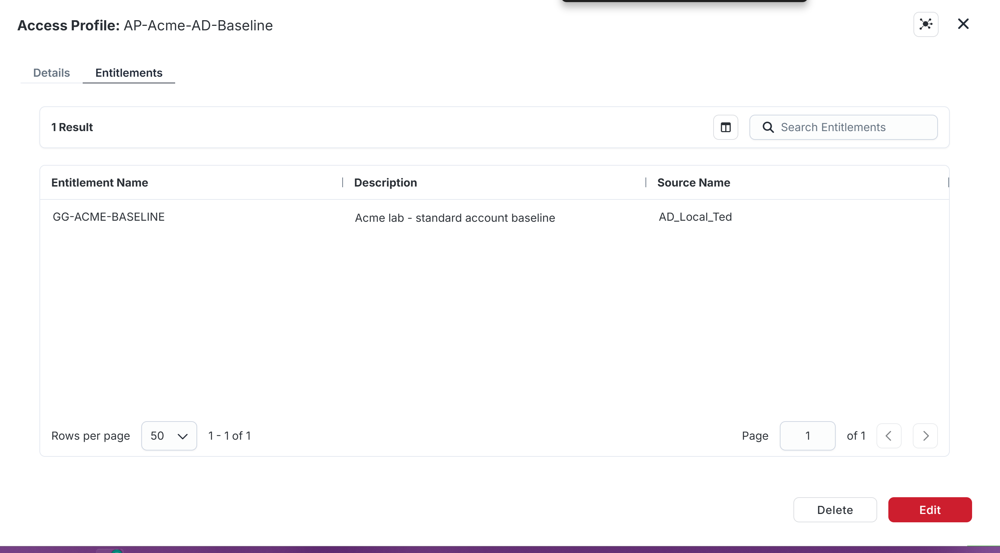
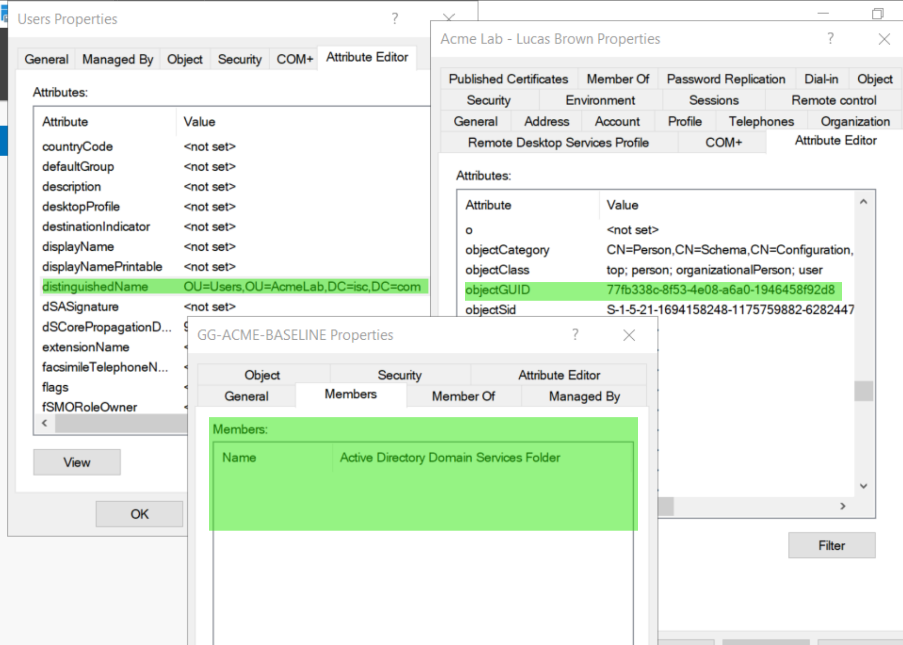
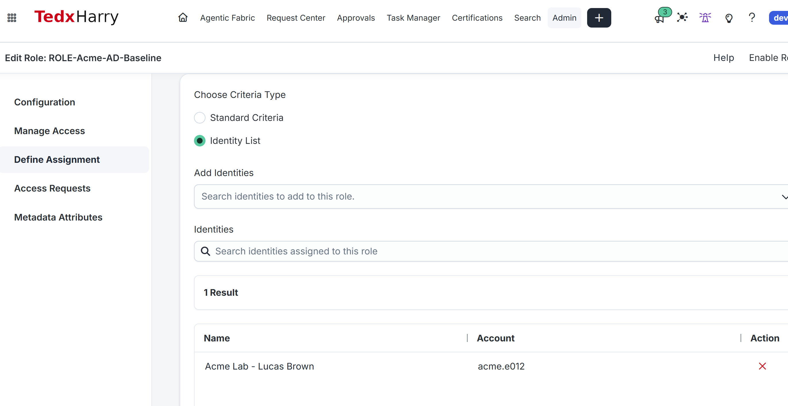
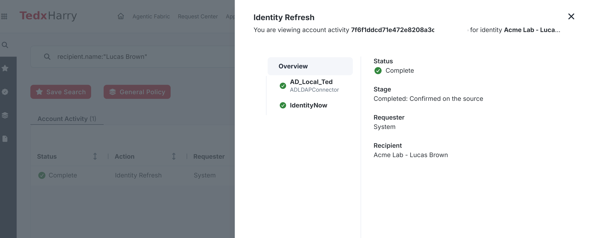
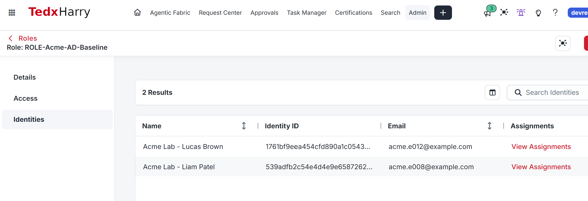
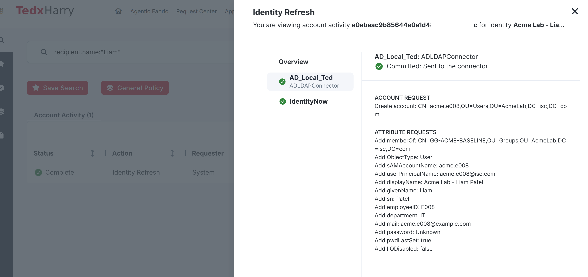
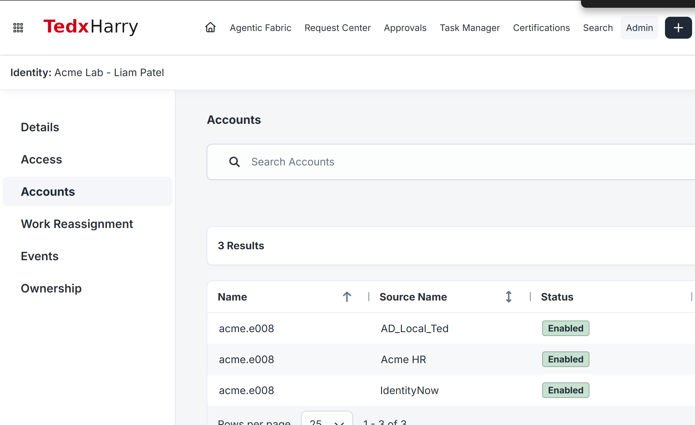

# AR-006 — Provision Your First AD Account

<a id="goal"></a>

In this lab, you'll add baseline membership to Lucas's existing AD account, then use the same role to create Liam's missing account and add its baseline membership.

1. Add group membership to Lucas's existing AD account.
2. Create Liam's missing AD account and add the same group membership.

## Before you start

Use the [Module 1 configuration record](../../M01-STATE.md) for actual environment values and the required retained state.

<a id="session-for-this-lab"></a>

Use your ISC administrator session for ISC steps and your AD administration workstation for directory steps.

<a id="prerequisites"></a>

Complete [AR-005](../AR-005/README.md).

From the previous labs, you need:

- Lucas's existing AD account correctly linked.
- Liam with no AD account.
- `GG-ACME-BASELINE` aggregated into ISC.
- The AD Create Account configuration saved.

Keep your [evidence journal](EVIDENCE.md) open.

**Returning after provisioning:** Reuse the existing baseline profile and role. Keep Lucas, Liam and any later course members selected. Inspect the saved creation/update activity and current AD accounts; do not remove membership, delete an account or reduce the role list to recreate the first-run screenshots.

## Follow the steps

### 1. Create the baseline access profile

1. Open **Admin > Access Model > Access Profiles**.
2. Search AP-Acme-AD-Baseline first. Reuse the matching course profile if it exists; select **Create New** only if absent.
3. Configure:

| Setting | Value |
|---|---|
| Name | AP-Acme-AD-Baseline |
| Owner | Your ISC administrator |
| Source | Your AD source |

4. Under **Manage Entitlements**, add only `GG-ACME-BASELINE`.
5. Save the access profile.
6. Enable it.
7. Leave access requests disabled.

Reference: [Access profiles](https://documentation.sailpoint.com/saas/help/access/access-profiles.html)

**Check:** `AP-Acme-AD-Baseline` contains exactly one entitlement: `GG-ACME-BASELINE`.

**Screenshot:** Save `AR-006-01-baseline-profile.png`. Capture the access profile and entitlement.



AP-Acme-AD-Baseline contains one entitlement on AD_Local_Ted in this example. Select your recorded AD source and also verify the profile is enabled with requests disabled.

### Record Lucas before assigning access

In **Active Directory Users and Computers**, enable **View > Advanced Features**, open Lucas’s **Properties > Attribute Editor** and record `distinguishedName` and `objectGUID` in the journal. Open **GG-ACME-BASELINE > Properties > Members** and confirm Lucas is absent. Compare these before-values after provisioning.

**Check:** You recorded Lucas’s original identifiers and the group has no Lucas membership.

**Screenshot:** Save `AR-006-02-lucas-before.png`. Capture Lucas’s DN, objectGUID and absence from baseline membership.



The Members panel is empty and the Lucas panel shows his objectGUID. The highlighted distinguishedName on the left belongs to the Users OU, not Lucas. Record Lucas's own distinguishedName from his Properties > Attribute Editor before comparing the account after provisioning.

### 2. Create the baseline role for Lucas

1. Open **Admin > Access Model > Roles**.
2. Select **Create New**.
3. Configure:

| Setting | Value |
|---|---|
| Name | ROLE-Acme-AD-Baseline |
| Owner | Your ISC administrator |

4. Add `AP-Acme-AD-Baseline` to the role.
5. Leave access requests disabled.
6. Open **Define Assignment**.
7. Select **Identity List**.
8. Add only Lucas Brown (`acme.e012`).
9. Save the role.
10. Enable the role.
11. Select **Apply Changes**.

Reference: [Role assignment](https://documentation.sailpoint.com/saas/help/provisioning/role_assignment.html)

**Check:** The role assignment contains only Lucas.

**Screenshot:** Save `AR-006-03-lucas-role.png`. Capture the role with Lucas in the identity list.



The first stage selects only Lucas. Save, enable and apply the role before checking its resulting activity; an edit-page selection alone does not prove provisioning.

### 3. Verify Lucas's existing account was updated

1. In **Admin > Dashboard > Monitor**, wait for the identity-processing work started by **Apply Changes** to finish. Do not add Liam while Lucas’s update is still processing or has failed.
2. Click **Search** in the top navigation and select **Account Activity**.
3. In the Search query box, enter the following. Replace `YOUR-AD-SOURCE-NAME` with the exact AD source name recorded in your Module 1 configuration record:
   ```text
   recipient.name:acme.e012 AND sources:"YOUR-AD-SOURCE-NAME"
   ```
4. Run the search. If more than one row is returned, use the time you selected **Apply Changes** and the **Created/Last Modified** values to open the activity produced by this role assignment.
5. Open the activity, select the AD source entry, and inspect the account operation. Record the activity ID or tracking number, operation time, final status, account/native identity, and the membership change. If it failed, record the exact error before continuing.
6. In Active Directory, open Lucas's existing account and record its current DN and objectGUID.
7. Open `GG-ACME-BASELINE > Properties > Members`.
8. Confirm Lucas is now a direct member.
9. Confirm Lucas's DN and objectGUID are unchanged.
10. Confirm no second `acme.e012` account was created.

If the query returns no row, first verify the source name and its capitalization, then search only `recipient.name:acme.e012`. Do not reapply the role just to create another activity. See [Find the Account Activity](../../LAB-DESK.md#find-the-account-activity).

Reference: [Tracking provisioning](https://documentation.sailpoint.com/saas/help/provisioning/tracking.html)

**Check:** ISC updated Lucas's existing account by adding baseline membership.

**Screenshot:** Save `AR-006-04-lucas-update.png`. Capture Lucas's successful activity and native group membership.



The Overview shows Complete and Confirmed on the source. Select the AD source entry to inspect the actual membership operation, then verify the baseline group in AD and Lucas's unchanged DN/objectGUID.

### 4. Add Liam to the same role

1. Confirm `acme.e008` is still absent from AD and the ISC AD-source accounts.
2. Open `ROLE-Acme-AD-Baseline`.
3. Open **Define Assignment > Identity List**.
4. Keep Lucas selected.
5. Add Liam Patel (`acme.e008`).
6. Confirm the list contains exactly Lucas and Liam.
7. Save the role.
8. Select **Apply Changes**.
9. Open Liam’s Account Activity as described below. Wait for a final result; do not repeatedly apply the role while processing is running.

**Check:** The role now contains Lucas and Liam.

**Screenshot:** Save `AR-006-05-pilot-role.png`. Capture the two-person identity list.



The role view now lists both pilot identities. Inspect Define Assignment to confirm both remain selected, then verify each account and native baseline membership.

### 5. Verify Liam's new AD account

1. Click **Search** in the top navigation and select **Account Activity**.
2. Search for Liam on the exact AD source and narrow to account creation:
   ```text
   recipient.name:acme.e008 AND sources:"YOUR-AD-SOURCE-NAME" AND @accountRequests(op:create)
   ```
   Replace `YOUR-AD-SOURCE-NAME` with the exact source name from your journal.
3. Open the newest matching activity created after you added Liam to the role. Select the AD source entry and record the activity ID or tracking number, final status, account/native identity, create operation, and any error or warning.
4. If the create-filtered query returns nothing, remove only `AND @accountRequests(op:create)` and search again. Do not reapply the role while the original operation may still be running.
5. In Active Directory, refresh **AcmeLab > Users**.
6. Open `acme.e008`.
7. Confirm:

| Attribute | Expected result |
|---|---|
| sAMAccountName | acme.e008 |
| employeeID | E008 |
| Display Name | Acme Lab - Liam Patel |
| Department | IT |
| Title | IT Analyst |
| DN | AcmeLab/Users location |
| UPN | acme.e008@your UPN suffix |

8. Inspect enabled/disabled state and password-change flags against your AR-005 expectations.
9. Open **GG-ACME-BASELINE > Properties > Members** and confirm Liam is a direct member.

**Check:** Liam's AD account exists with the expected attributes and baseline membership.

**Screenshot:** Save `AR-006-06-liam-created.png`. Capture Liam's provisioning activity, AD account, and group membership.



The AD detail shows Create account and the requested attributes, including employeeID E008 and baseline membership. Its displayed stage is Committed: Sent to the connector. Even though the background row says Complete, check the actual AD account and membership rather than treating this panel alone as target verification. The requested password is hidden as Unknown.

### 6. Aggregate and verify Liam's account link

1. Run one AD account aggregation from **Account Management > Account Aggregation**.
2. Wait for completion.
3. Open **Admin > Identity Management > Identities**.
4. Search for `acme.e008` and open Liam.
5. Open **Accounts**.
6. Confirm the new AD account is linked to Liam.
7. Confirm the imported account contains `employeeID = E008`.
8. Confirm baseline membership is visible after aggregation.

**Check:** Liam's AD account is linked to the correct ISC identity.

**Screenshot:** Save `AR-006-07-liam-linked.png`. Capture Liam's identity with the linked AD account.



Liam has an Enabled AD_Local_Ted account linked to his identity. Acme HR and IdentityNow are separate source rows. Count one account on the course AD source, not exactly two accounts across all sources; open the AD row to verify imported employeeID and membership.

### 7. Compare the two provisioning results

Record the difference:

| Identity | Starting state | Provisioning result |
|---|---|---|
| Lucas | Existing correlated AD account | Add baseline group membership |
| Liam | No AD account | Create account, then add baseline group membership |

Both users received the same access profile. Their account state determined the operation required on the target.

**Check:** Your journal identifies the update operation for Lucas and create operation for Liam, with native AD evidence for each.

## Check the result

### What you will finish with

| Identity | Expected AD result |
|---|---|
| Lucas Brown — acme.e012 | Existing account retained; baseline group added |
| Liam Patel — acme.e008 | New AD account created; baseline group added |

---

### Try it yourself

Reopen both provisioning activities and locate the exact operation that added baseline membership. Compare Lucas’s before/after objectGUID. Retain both accounts and assignments; do not remove access to repeat creation.

Write these answers in your [journal](EVIDENCE.md):

1. Why did Lucas receive a membership update while Liam needed account creation?
2. Which evidence proves the write reached AD?

### If a check does not match

If the activity is still pending, follow it before applying again. If it fails:

1. Reopen the matching **Search > Account Activity** result and select the AD source entry. Read the account-create and group-membership results separately. Copy the exact error into your private journal.
2. Inspect the named account in AD before trying again. If Liam already exists, keep that account; a failed group operation does not mean account creation failed. For a naming or attribute error, compare the reported value with your saved AR-005 mappings. For a membership error, compare the reported group DN with GG-ACME-BASELINE in AD.
3. Correct the setting identified by the error. Automatic role provisioning retries only retryable failures, once per hour, up to three times. Follow the activity and recheck AD after the attempt; do not remove and re-add the role to force a retry.
4. If the error is not retryable or all attempts have failed, keep the account and role assignments in place. Give your lab administrator or SailPoint support the exact error, activity ID and current AD result to determine the supported recovery. Continue only when the account is linked correctly and its baseline membership is present.

[Role provisioning retries](https://documentation.sailpoint.com/saas/help/provisioning/role_assignment.html#role-provisioning-retries)

### Final verification

- [ ] The independent check and both explanations are recorded.
- [ ] `AP-Acme-AD-Baseline` exists and contains only GG-ACME-BASELINE.
- [ ] `ROLE-Acme-AD-Baseline` exists and is enabled.
- [ ] Lucas and Liam are both assigned to the role.
- [ ] Lucas's original AD account was retained.
- [ ] Lucas is a direct member of GG-ACME-BASELINE.
- [ ] Liam's AD account was created by ISC.
- [ ] Liam's AD attributes match the Create Account configuration.
- [ ] Liam is a direct member of GG-ACME-BASELINE.
- [ ] Liam's account is linked to `acme.e008` after aggregation.
- [ ] No unresolved provisioning activity remains.

## Finish

### Leave this in place

Keep the access profile, role, Lucas assignment, Liam assignment, both AD accounts, and both baseline memberships in place.

**Additional captures:** Save `AR-006-08-native-accounts.png` for the native checks and `AR-006-09-source-operation.png` for expanded source operations. Use multiple panels when needed.

### Screenshots to capture

The supplied screenshots are placed beside their matching steps. Add the remaining views when available; keep earlier creation evidence labelled historical when revisiting the lab.

| Filename | Coverage and remaining capture |
|---|---|
| AR-006-01-baseline-profile.png | Baseline profile containing one GG-ACME-BASELINE entitlement. Included; see the limits beside the image. |
| AR-006-02-lucas-before.png | Empty baseline Members list, Lucas objectGUID and Users OU DN. Included; see the limits beside the image. |
| AR-006-03-lucas-role.png | Baseline role Identity List selecting only Lucas. Included; see the limits beside the image. |
| AR-006-04-lucas-update.png | Lucas Identity Refresh activity marked Complete and confirmed on the source. Included; see the limits beside the image. |
| AR-006-05-pilot-role.png | Baseline role Identities view listing Lucas and Liam. Included; see the limits beside the image. |
| AR-006-06-liam-created.png | Liam AD create request and requested account attributes. Included; see the limits beside the image. |
| AR-006-07-liam-linked.png | Liam identity Accounts view with AD, Acme HR and IdentityNow rows. Included; see the limits beside the image. |
| AR-006-08-native-accounts.png | Still to add: Lucas unchanged account DN/GUID, Liam AD attributes/enabled state and both direct baseline memberships. |
| AR-006-09-source-operation.png | Still to add: expanded Lucas AD membership operation and completed Liam source result. |

Keep passwords, tokens and invitation links out of shared images.

Next: **[AR-007 — Provision the Remaining Standard Accounts](../AR-007/README.md)**

[Previous: AR-005](../AR-005/README.md) · [Lab index](../README.md)
