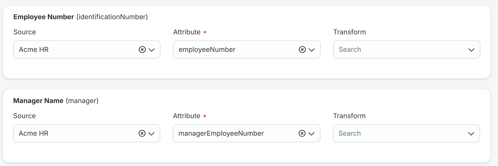
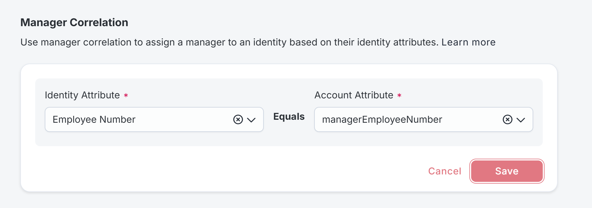
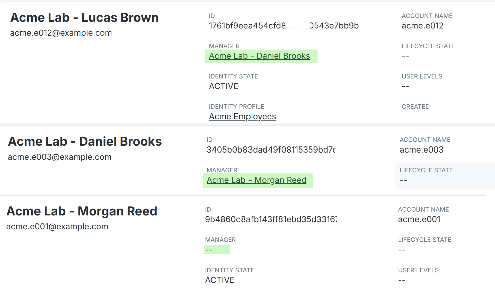

# AR-002 — Resolve the Manager Hierarchy

**Level:** Beginner

**Prerequisites:** Acme HR contains the 24 employee accounts, and Acme Employees has the corresponding identities and baseline attributes from [AR-001](../AR-001/README.md).

Starting here for the first time? Follow the configuration sections in order, verify the working result, then complete the practice. The existing-configuration entry below applies only when those objects have already been verified.

## If this configuration already exists

Confirm Lucas → Daniel → Morgan and record Lucas’s current E003 manager reference before the reversible practice. Read the configuration sections to compare your saved settings, but skip creation actions for objects already verified. Start the additional practice at [Practice: a valid identifier pointing to the wrong manager](#practice-a-valid-identifier-pointing-to-the-wrong-manager). Capture current results and label earlier creation activity as historical.

Use the [Module 1 configuration record](../../M01-STATE.md) for actual environment values and the required retained state.

## Before you open the settings

Use your ISC administrator session, Acme HR, Acme Employees and the latest complete working HR file.

Open Lucas and Daniel first. Lucas must have identificationNumber E012 and Daniel E003. Keep the raw manager references in the CSV; they are not resolved manager identities yet.

Do not change the AD source in this lab. You are matching employees to managers using HR data.

## What you’ll do

Lucas’s HR record says his manager is E003. You and I can look that up in the file, but ISC needs a link to Daniel’s identity. Set up that match, then check the rest of the team and correct a deliberately wrong manager reference.

Use the existing HR source, profile, and [baseline dataset](../../datasets/acme-hr-baseline.csv). No new source or AD configuration is needed.

## What you will finish with

| Employee | Expected manager |
|---|---|
| Lucas Brown — E012 | Daniel Brooks — E003 |
| Daniel Brooks — E003 | Morgan Reed — E001 |
| Morgan Reed — E001 | No manager; hierarchy root |

The full dataset has **23 employee-to-manager relationships and one root**. Keep notes in the [evidence journal](EVIDENCE.md).

## 1. Follow one relationship through the data

1. Open **Admin > Connections > Sources > Acme HR > Account Management > Accounts**.
2. Open `acme.e012`. Confirm `employeeNumber` is `E012` and `managerEmployeeNumber` is `E003`.
3. Open **Admin > Identity Management > Identities** and find Daniel Brooks (`acme.e003`). Confirm he exists as an identity under **Acme Employees**.
4. Open **Acme Employees > Mappings** and locate the identity attribute that receives **Acme HR > employeeNumber**. The course uses **Employee Number (`identificationNumber`)**.

**Check:** The employee's manager reference is `E003`, and the manager's own employee identifier is `E003`. Those are the matching values. Lucas's own number, `E012`, is not the value to use to identify his manager.

### Check the identity attribute name

In **Acme Employees > Mappings**, the field is **Employee Number (`identificationNumber`)**. Select **Employee Number** in the correlation dropdown. The label and technical name refer to the same identity attribute; do not create a second attribute. Map it to **Acme HR > employeeNumber** if needed, then save and apply changes.

## 2. Map Manager Name

1. Open **Admin > Identity Management > Identity Profiles > Acme Employees > Mappings**.
2. Locate **Manager Name** and use the following direct mapping:

| Field | Select |
|---|---|
| Source | Acme HR |
| Attribute | managerEmployeeNumber |
| Transform | Leave unselected |

3. Save the mappings.

Despite its label, Manager Name takes the reference supplied by this HR feed. Do not replace the CSV's employee numbers with display names. [Identity-profile mappings](https://documentation.sailpoint.com/saas/help/setup/identity_profiles.html)

**Check:** Manager Name reads from `managerEmployeeNumber`; Employee Number reads from `employeeNumber`. Capture both mappings.

**Screenshot reminder:** Capture the Manager Name and Employee Number mappings.



Employee Number (identificationNumber) reads employeeNumber; Manager Name (manager) reads managerEmployeeNumber from Acme HR.

## 3. Configure the manager match

1. Open **Admin > Connections > Sources > Acme HR > Account Management > Account Correlation**.
2. Scroll to **Manager Correlation**. Leave the separate account-to-identity correlation settings unchanged.
3. Select:

| Field | Select |
|---|---|
| Identity Attribute | Employee Number (`identificationNumber`) |
| Account Attribute | managerEmployeeNumber |

4. Select **Save**.

The Identity Attribute is checked on the **manager's identity**. The Account Attribute supplies the manager reference from the **employee's HR account**. Both this source configuration and the Manager Name mapping are required. [Manager correlation](https://documentation.sailpoint.com/saas/help/sources/manager_correlation.html)

**Check:** Your configuration expresses this match:

```text
Lucas's HR account: managerEmployeeNumber = E003
                              matches
Daniel's identity: identificationNumber = E003
                              result
Lucas's manager = Daniel Brooks
```

**Screenshot reminder:** Capture the saved Manager Correlation selections.



Select Employee Number on the identity side and managerEmployeeNumber on the account side, then save. Equals is displayed between the fields.

## 4. Apply and process the identities

1. Return to **Acme Employees** and select **Apply Changes**.
2. Open **Admin > Dashboard > Monitor** to inspect running identity-processing jobs.
3. When processing completes, reopen Lucas's identity and check **Manager**.
4. If you added the Employee Number mapping in Section 1, first verify it populated Daniel's identity. If Lucas is still unresolved after that, locate Lucas on **Admin > Identity Management > Identities**, select **Actions > Process Identity**, and check the result again.

Profile changes require applying; processing selected identities provides a targeted retry after correcting their data. Do not repeatedly submit jobs while one is still running. [Identity processing](https://documentation.sailpoint.com/saas/help/setup/identity_processing.html)

**Check:** Lucas's Manager resolves to Daniel Brooks. Daniel's own employee identifier remains `E003`; his manager reference is `E001`.

## 5. Check everyone’s manager

For each group below, inspect the employee identities' **Manager** value. Use the usernames from the CSV to distinguish people with similar names. Record the actual result for every employee in your journal.

| Expected manager | Employee IDs reporting to that manager | Count |
|---|---|---:|
| Morgan Reed — E001 | E002, E003, E004, E005, E006, E007 | 6 |
| Priya Shah — E002 | E008, E009, E010, E024 | 4 |
| Daniel Brooks — E003 | E011, E012, E013 | 3 |
| Elena Cruz — E004 | E014, E015 | 2 |
| Marcus Lee — E005 | E016, E017 | 2 |
| Ava Chen — E006 | E018, E019, E020 | 3 |
| Noah Williams — E007 | E021, E022, E023 | 3 |
| No manager | E001 | 1 |

**Check:** Morgan is the only intentional root. No employee is their own manager. The HR account and Acme identity counts remain 24.

Manager relationships prepare the data for later manager-approval labs. Their presence alone does not demonstrate that an approval policy has been configured or tested.

**Screenshot reminder:** Capture Lucas with Daniel as manager, Daniel with Morgan, and Morgan with no manager.



Lucas reports to Daniel, Daniel reports to Morgan, and Morgan has no manager. Check the remaining employees against the roster too.

## Practice: a valid identifier pointing to the wrong manager

Before the live data-change exercise, confirm there are no pending course approvals/provisioning operations and no unrelated automation depending on the field you will change. Record the original value. If later configuration now acts on this field, use the supplied ticket case until you have an isolated test window. Restore and verify the original value before the next lab.

Complete this after the correct hierarchy is verified. Use only the Acme lab population.

1. Save a private copy of your latest complete working HR CSV. Preserve every record and controlled email address.
2. In a second copy, change only Lucas E012’s managerEmployeeNumber from `E003` to `E002`. Priya exists, so this is a wrong business relationship with a valid identifier.
3. Upload the complete edited file using AR-001’s import procedure. Wait for processing, then inspect Lucas’s HR manager reference and identity Manager. Record whether it resolves to Priya.
4. Compare the CSV, source account, correlation pair and resolved manager. The correlation configuration can be correct while HR supplies the wrong relationship. Do not change the matching rule to compensate.
5. Restore the saved complete file, import/process and verify Lucas resolves to Daniel again. Confirm Morgan remains the root and the other relationships are unchanged.
6. Capture the incorrect and corrected manager results with the corresponding HR values. Do not continue while Lucas’s manager is still Priya.

This exercise changes manager data, not an approval policy. The later Manager-review lab proves which person actually receives a submitted request.

**Screenshot reminder:** Save the temporary Priya result and the restored Daniel result before leaving the practice.

## If a manager does not resolve

| Observation | What to check next |
|---|---|
| Manager is blank on Lucas | His HR account's managerEmployeeNumber, then both configurations in Sections 2 and 3 |
| Manager reference is E003, but no match appears | Daniel exists and his selected identity attribute contains exactly E003 |
| Manager reference is a number but the selected identity attribute holds a username | Use the matching employee-number attribute rather than uid |
| Employee Number is missing from the dropdown | Reopen Acme Employees > Mappings and verify the technical name identificationNumber and its employeeNumber source mapping; confirm you are editing the Acme HR source |
| The saved configuration is correct but the result is old | Check processing and use the targeted action in Section 4 after confirming the data |
| An unexpected manager appears | Compare the actual manager identity's identifier with the employee's HR reference; check duplicate identifiers and other profile/source mappings |

An unmatched changed reference does not necessarily clear an existing manager: SailPoint documents that the previous relationship can remain when the new value cannot be correlated. Diagnose the stored reference and resolved identity together. [Manager-correlation behavior](https://documentation.sailpoint.com/saas/help/sources/manager_correlation.html)


## Your ticket: Lucas is assigned to Priya even though the rule looks correct.

Use the wrong-manager result you captured in this lab, or treat it as a supplied case if you have not executed that exercise.

Identify the HR value, the matched manager and the narrow correction. Explain why changing the matching rule would be the wrong repair.

Write your diagnosis and the evidence you would accept before opening the solution. If you use the supplied case, label it a ticket exercise; do not record it as a tenant failure you observed.

<details>
<summary>Compare your diagnosis with the mentor’s solution</summary>

E002 is a valid identifier for Priya. The matching rule can work correctly on incorrect HR data. Restore E003 in the complete working file, import/process and verify Daniel on Lucas’s identity. Keep the rule that compares the employee’s manager reference with the manager’s own identificationNumber.

</details>

## If you stopped midway or want to repeat this lab

If interrupted during the wrong-manager exercise, inspect E012 in both the working CSV and HR account before proceeding. Restore managerEmployeeNumber E003, upload the complete file and check Daniel is the resolved manager. Keep the mappings and manager-correlation pair. When repeating later, preserve added employees and report the original 23 relationships separately from any later additions.

## What you should leave in place

| Item | State before you continue |
|---|---|
| Manager relationships | Original roster: 23 matches; Morgan has no manager |
| Lucas → Daniel → Morgan | Restored and checked on the identities |
| HR file | Complete current file retained; no wrong-manager value left behind |

## Completion checklist

- [ ] The practice/comparison and your ticket diagnosis are recorded in the journal.
- [ ] Any temporary change is restored and the retained state matches the next lab.
- [ ] Manager Name uses Acme HR > managerEmployeeNumber.
- [ ] identificationNumber uses Acme HR > employeeNumber.
- [ ] Manager Correlation matches those two attributes in the correct direction.
- [ ] Lucas resolves to Daniel, and Daniel resolves to Morgan.
- [ ] All 23 expected relationships are verified; Morgan has no manager.
- [ ] The baseline data and 24-employee population are preserved.

## Screenshots to retain

- Manager Name and Employee Number mappings.
- The Manager Correlation dropdown selections.
- Lucas's identity with Daniel shown as Manager.
- Daniel's identity with Morgan shown as Manager.
- Morgan's identity with no Manager.
- Lucas temporarily showing Priya during the practice, then Daniel after restoration.

Keep this configuration for the later request-approval exercises.

[Previous: AR-001](../AR-001/README.md) · [Next: AR-003](../AR-003/README.md) · [Course outline](../../README.md)
