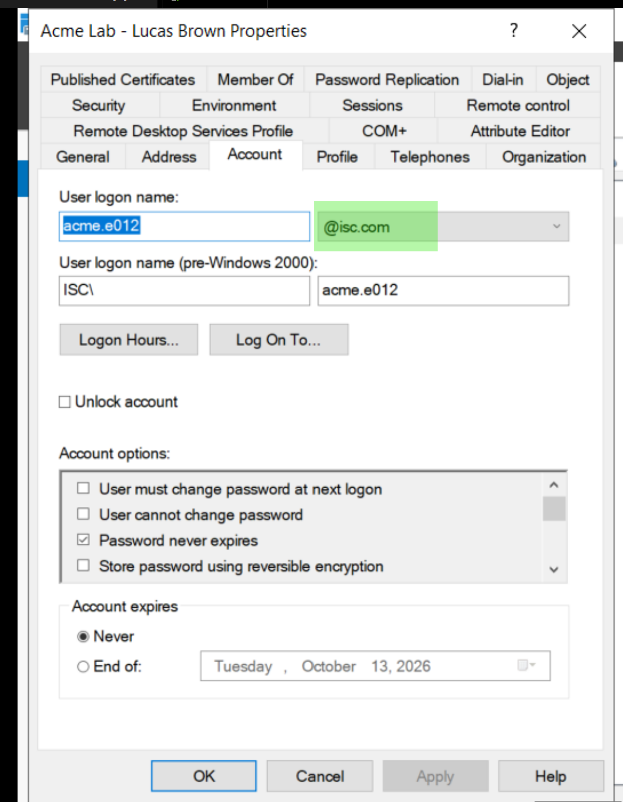
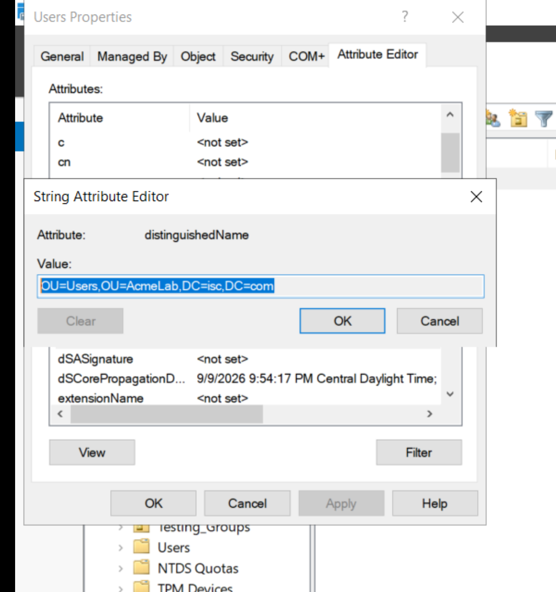
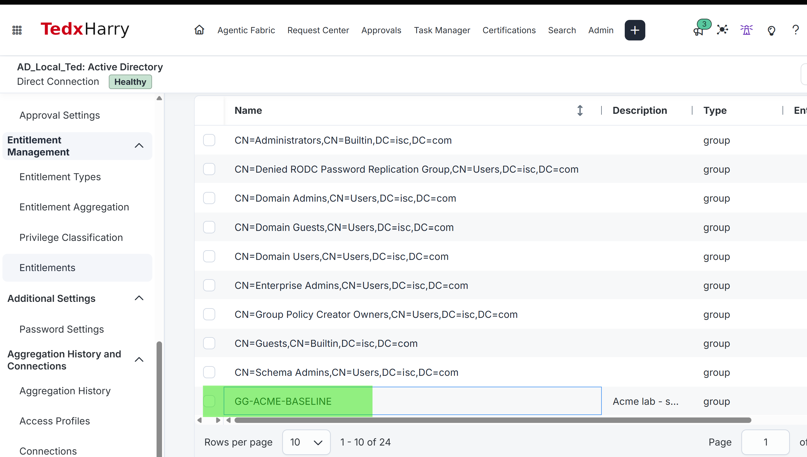
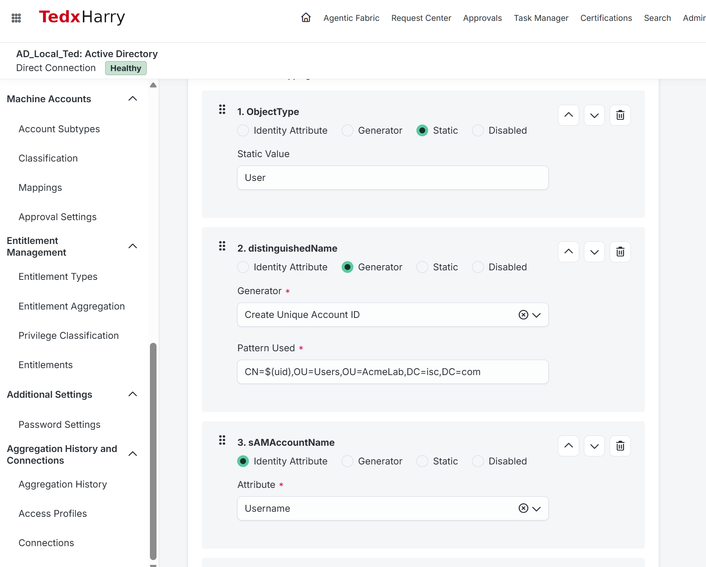
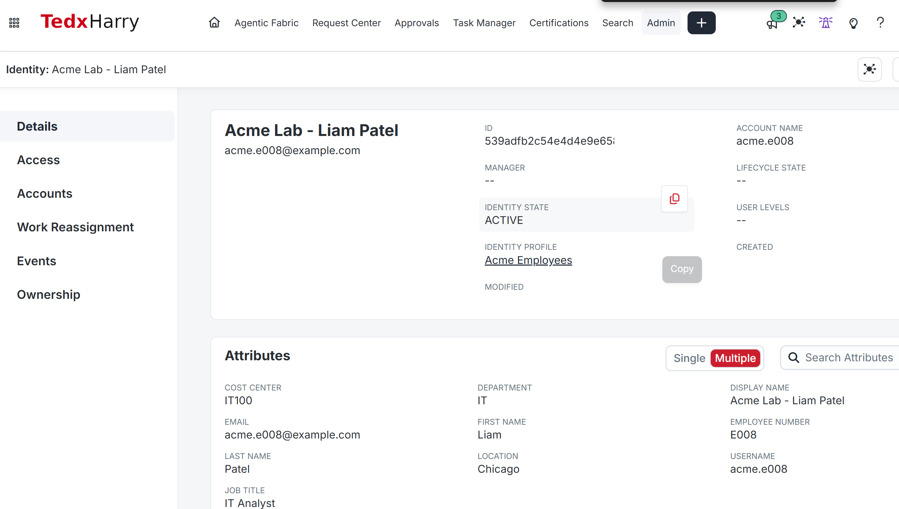

# AR-005 · Configure AD Account Creation

<a id="what-youll-do"></a>

In this lab, you'll configure the AD account-creation mappings and check the values ISC will use for Liam. Saving these mappings does not create his account; AR-006 triggers that operation.

## Before you start

**Prerequisites:** Complete [AR-004](../AR-004/README.md). Your AD connector must support direct provisioning, with its VA, IQService, TLS, and service-account permissions configured.

<a id="before-you-open-the-settings"></a>

Use your ISC administrator session and the AD workstation. Have the existing provisioning/IQService configuration and your actual Users OU DN available.

Lucas is correctly linked. Liam has an ISC identity but no AD account. Keep that missing-account case for AR-006.

Record the current Create Account mappings before editing. These settings apply to future account creation on this source, not just Liam.

Use the [Module 1 configuration record](../../M01-STATE.md) for actual environment values and the required retained state.

**Returning after AR-006:** Keep Liam's existing account, the saved mappings and baseline memberships. Compare current settings with this lab and use the original creation activity as historical evidence; do not delete his account to recreate the starting screenshot.

## Follow the steps

### 1. Check the write connection

1. Open your AD source and record its provisioning and IQService connection settings without recording credentials.
2. Check the existing installation against the [AD prerequisites](https://documentation.sailpoint.com/connectors/active_directory/help/integrating_active_directory/prerequisites.html) and [required permissions](https://documentation.sailpoint.com/connectors/active_directory/help/integrating_active_directory/required_permissions.html). The connector must be able to create users in the actual Users OU, set their required attributes and password, and update membership of the baseline group you will create below.
3. Run the source's **Review and Test > Test Connection**. Resolve errors before proceeding. This test is preliminary; AR-006 will prove an actual write.
4. Follow the UPN and OU lookup steps below, then record the exact Users OU DN and configured AD UPN suffix. Confirm the OU is covered by the saved search settings from AR-003.

If your connection only reads accounts, complete its provisioning prerequisites before continuing. A manual work item asking a person to create an account does not satisfy this lab's direct-provisioning check.

#### Find and record your UPN suffix

A **User Principal Name (UPN)** is an AD sign-in name such as `acme.e012@isc.com`. The **suffix** is the part after `@`: `isc.com` in that example. It can differ from the employee's email domain.

1. On your AD workstation, open **Server Manager > Tools > Active Directory Users and Computers**.
2. Expand your training domain, then **AcmeLab > Users**.
3. Right-click **Acme Lab - Lucas Brown > Properties** and open **Account**.
4. Find **User logon name**. Read the username on the left and the selected suffix on the right. For example, `acme.e012` and `@isc.com` together form `acme.e012@isc.com`.
5. In your journal, record Lucas's full UPN and the suffix **without `@`**. Use this same configured suffix for the new standard lab users. Close with **Cancel**; you are inspecting Lucas, not changing his sign-in name.
6. If several suffixes are available, record the one selected for Lucas's standard lab account. If his UPN is blank, check the suffix selected on another working standard account in the same training domain. Do not invent a suffix from the HR email addresses.

The **User logon name (pre-Windows 2000)** field is a different sign-in format, such as `ISC\acme.e012`; do not copy `ISC` as the UPN suffix. If you need to inspect configured alternatives, open **Server Manager > Tools > Active Directory Domains and Trusts**, right-click the top **Active Directory Domains and Trusts** node, select **Properties**, and view **UPN Suffixes**. An empty alternative-suffix list does not mean the domain has no default suffix. No new suffix is required for this lab. [Microsoft UPN guidance](https://learn.microsoft.com/en-us/entra/identity/hybrid/connect/howto-troubleshoot-upn-changes)

**Check:** Your journal contains an observed full UPN and its suffix. For a confirmed suffix of `isc.com`, the ISC mapping will be `${sAMAccountName}@isc.com`, and Liam's expected UPN will be `acme.e008@isc.com`. Keep `${sAMAccountName}` as an expression in the mapping; do not replace it with Lucas's or Liam's username.

**Screenshot:** Save `AR-005-upn-suffix.png` showing Lucas's **Account** tab and the selected suffix.



Read the selected suffix, `isc.com` in this example. The password and expiry options shown belong to this existing Lucas account; do not copy them into the account-creation policy.

#### Copy the target OU DN

The OU's **distinguished name (DN)** tells ISC where to create the user. Copy the OU value, not Lucas's account DN.

1. In **Active Directory Users and Computers**, select **View > Advanced Features**.
2. Right-click the **Users** OU directly beneath **AcmeLab**, then select **Properties > Attribute Editor**.
3. Select **distinguishedName > View** (or **Edit**, if offered), copy the complete value, and close without changing it.
4. Record that value as **Users OU DN**. If the Attribute Editor tab is missing, close Properties, confirm Advanced Features is selected, and reopen the OU directly from the tree.
5. Compare it with the saved **User Search Scope > Search DN** in your AD source's **Account and Group Settings**. The search must cover this OU before provisioning.

For example, if the copied value is `OU=Users,OU=AcmeLab,DC=isc,DC=com`, enter `CN=$(uid),OU=Users,OU=AcmeLab,DC=isc,DC=com` in the DN generator. Preserve any additional parent OUs present in your real DN. A value beginning `CN=Acme Lab - Lucas Brown,` is Lucas's account DN, not the target OU DN.

**Check:** The recorded target starts with your Users OU and ends with your actual domain components. Save `AR-005-users-ou-dn.png` showing this value.



This is the target OU DN, `OU=Users,OU=AcmeLab,DC=isc,DC=com`. The generated user DN adds `CN=$(uid),` before your own OU value.

### 2. Prepare a separate baseline group

1. In **Active Directory Users and Computers**, open **AcmeLab > Groups** and look for `GG-ACME-BASELINE` before opening the creation dialog.
2. Check whether `GG-ACME-BASELINE` exists. When resuming, reuse the verified lab group and record its members; do not empty it or create a duplicate. If it is missing, right-click **Groups > New > Group**, enter `GG-ACME-BASELINE`, select scope **Global** and type **Security**, then **OK**. Reopen its **Properties > General**, enter description `Acme lab - standard account baseline`, and select **Apply**. Leave its membership empty on this first run.
3. Record its DN and confirm the connector can update this group's membership. This group grants no real application or administrative access.
4. In ISC, run the AD source's **Entitlement Management > Entitlement Aggregation**. Verify the baseline group appears on the correct source and record its entitlement value.

**Check:** You now have 15 course groups: the original 14 plus this baseline group. Keep the baseline group separate from VPN and Finance grants.

**Screenshot reminder:** Save `AR-005-01-baseline-group.png`. Use the matching descriptions in the screenshot checklist at the end.



The supplied image shows the imported ISC entitlement, not the AD Members tab. The source also contains unrelated groups, so its total of 24 results is not the count of Acme course groups. Open this entitlement to check its full native value.

### 3. Define the account attributes

For the separate ISC ID and native group value, follow [the entitlement lookup](../../LAB-VALUES.md#separate-entitlement-ids-from-native-group-values). Record both beside the source name.

Open **Admin > Connections > Sources > your AD source > Account Management > Create Account**. Record the existing configuration before editing. On a source used by other exercises, ensure this Users-OU policy is appropriate for every account creation the source will perform.

For each row in the table:

1. Locate the attribute in **Account Attribute Mappings** and choose the mapping type.
2. For **Identity Attribute**, select the named identity attribute. For **Generator**, choose the generator and enter Pattern Used where supplied. For **Static**, enter the literal value/expression. For **Disable**, select Disable to omit the attribute.
3. If missing, select **Add Mapping > Add Existing Attribute**, choose the attribute and Add. Use **Create New Attribute** only for a supported AD attribute absent from that list. This does not add an aggregation schema attribute.
4. Use the up/down arrows or drag control to place sAMAccountName above userPrincipalName. **Save**, leave the page and reopen it to verify values and order.

Set these mappings. Replace `YOUR-USERS-OU-DN` and `YOUR-UPN-SUFFIX` with your actual values. The `$(uid)` and `${sAMAccountName}` expressions below are literal expressions, not placeholders to replace with Liam's username.

| Account attribute | Mapping type | Value or selection |
|---|---|---|
| ObjectType | Static | User |
| distinguishedName | Generator: Create Unique Account ID | Pattern Used: `CN=$(uid),YOUR-USERS-OU-DN` |
| sAMAccountName | Identity Attribute | Username (`uid`) |
| userPrincipalName | Static | `${sAMAccountName}@YOUR-UPN-SUFFIX` |
| displayName | Identity Attribute | Display Name (`displayName`) |
| givenName | Identity Attribute | First Name (`firstname`) |
| sn | Identity Attribute | Family Name (`lastname`) |
| employeeID | Identity Attribute | Employee Number (`identificationNumber`) |
| department | Identity Attribute | Department (`department`) |
| title | Identity Attribute | Job Title (`title`) |
| mail | Identity Attribute | Work Email (`email`) |
| password | Generator | Create Password |
| pwdLastSet | Static | true, requiring a password change at first AD logon |
| manager | Disable | Omit for this baseline; managers' AD accounts do not all exist yet |

Place sAMAccountName above userPrincipalName because the latter uses its calculated account value. If a row is missing, use **Add Mapping > Add Existing Attribute**; use **Create New Attribute** only for a supported AD attribute absent from the list. Save after editing. [Create Account configuration and expression syntax](https://documentation.sailpoint.com/saas/help/provisioning/create_profile.html)

Keep unrelated optional Exchange, home-directory, and script settings disabled unless your lab explicitly requires them. Retain the connector's other required defaults. Review any pre-existing custom provisioning rules before relying on the table alone.

The password generator uses the source's assigned ISC password policy. Verify that policy satisfies the target domain's password requirements. Do not insert a shared static password. [AD default provisioning attributes](https://documentation.sailpoint.com/connectors/active_directory/help/integrating_active_directory/provisioning_reference.html)

The chosen usernames are unique course IDs under AD's length limit. If a username or DN already exists, investigate its owner instead of adding a suffix to bypass the collision. This exercise deliberately avoids a naming counter so expected account names stay predictable.

**Screenshot reminder:** Save `AR-005-02-create-account-mappings.png`. Use the matching descriptions in the screenshot checklist at the end.



The visible rows show `ObjectType = User`, the DN generator and Username mapping. Scroll further to verify the UPN expression/order, employeeID, password and remaining rows; they are outside this capture.

#### Inspect the password policy before creating an account

The password generator needs rules that AD will accept. Record the policies first; a connection test does not validate a generated password.

1. In ISC, open **Admin > Connections > Sources > your AD source > Additional Settings > Password Settings**. Record the selected password policy. If **Use Sync Group** is enabled, record the group without changing it; open **Admin > Password Mgmt > Sync Groups**, select that group, and record its policy.
2. Open **Admin > Password Mgmt > Policies**, select the recorded policy, and inspect its length and character requirements. Keep this page open for comparison. [ISC password policies](https://documentation.sailpoint.com/saas/help/pwd/pwd_policies/pwd_policies.html) and [source policy/sync-group settings](https://documentation.sailpoint.com/saas/help/pwd/sync_grps.html).
3. On your AD administration workstation, open **Windows PowerShell** and run the read-only block below. Enter the training domain's DNS name, such as `isc.com`, when prompted. This is the AD domain, which can differ from an alternative UPN suffix.

```powershell
Import-Module ActiveDirectory -ErrorAction Stop
$LabDomain = Read-Host 'Training AD domain DNS name'
Get-ADDefaultDomainPasswordPolicy -Identity $LabDomain -ErrorAction Stop |
    Select-Object MinPasswordLength,ComplexityEnabled,PasswordHistoryCount,MinPasswordAge,MaxPasswordAge
Get-ADUserResultantPasswordPolicy -Identity 'acme.e012' -Server $LabDomain -ErrorAction Stop |
    Select-Object Name,MinPasswordLength,ComplexityEnabled,PasswordHistoryCount
```

The first result is the domain default. The second checks for a fine-grained policy applying to Lucas. No second result means no resultant fine-grained policy was returned; an error is not the same as an empty result. If a fine-grained policy applies, record it and check which users/groups it targets with your AD administrator. Lucas's result does not establish which policy a new Liam account will receive. [Domain policy](https://learn.microsoft.com/en-us/powershell/module/activedirectory/get-addefaultdomainpasswordpolicy) and [resultant user policy](https://learn.microsoft.com/en-us/powershell/module/activedirectory/get-aduserresultantpasswordpolicy).

4. Compare the ISC generation rules with the applicable AD requirements. Also account for any installed password filter or custom provisioning rule. Record the ISC policy name, AD requirements and any unresolved difference in the journal. Keep domain policy and sync-group membership unchanged during this inspection.
5. If the rules conflict, resolve the assigned ISC policy with the lab administrator before triggering creation. AR-006's actual account creation will verify acceptance; checking policy settings alone is not proof.

If `Import-Module` fails, use the AD server or a workstation with the Active Directory RSAT tools installed. Save `AR-005-password-policy.png` showing policy names and requirements, without a password or secret.

### 4. Check the values before triggering creation

1. Reopen **Create Account** and inspect the saved rows and order. Record the expected enabled/disabled state under your existing connector configuration; this table does not independently configure account enablement.
2. Open Liam's ISC identity. Verify his Manager is Priya (`acme.e002`) from AR-002; this is separate from the disabled AD manager mapping. Confirm uid `acme.e008`, identificationNumber `E008`, first name Liam, last name Patel, displayName `Acme Lab - Liam Patel`, department IT, and title IT Analyst.
3. Write the expected values in your journal: `CN=acme.e008,` followed by your Users OU DN, and `acme.e008@` followed by your UPN suffix.
4. Search AD and the ISC AD source for `acme.e008`. Confirm no account exists. If one does, record it and resolve the baseline discrepancy before this new-account exercise; do not delete it just to continue.
5. Confirm employeeID is also in the aggregation schema from AR-004. A creation mapping alone does not add an attribute to imported account data.

**Check:** Your written expectations match the saved configuration; actual creation still needs to be checked in AR-006. Saving Create Account does not itself create Liam's account. AR-006 supplies the access assignment that triggers creation.

**Screenshot reminder:** Save `AR-005-03-liam-identity.png`. Use the matching descriptions in the screenshot checklist at the end.



The account-creation attributes are visible, but Manager is blank in this capture. Recheck Liam against AR-002: his ISC manager should be Priya (`acme.e002`). Resolve a currently blank manager before the later approval labs. Disabling the AD manager creation mapping does not remove the need for a correct ISC manager relationship.

## Check the result

### Completion and screenshots

- [ ] Provisioning prerequisites reviewed; Users OU and baseline-group permissions checked.
- [ ] GG-ACME-BASELINE is imported; empty on the first run, or retained course memberships recorded when resuming.
- [ ] Required mappings, expression order, target OU, and password policy are recorded.
- [ ] Liam's attributes are ready and he has no AD account.

Also capture AR-005-upn-suffix.png, AR-005-users-ou-dn.png and AR-005-password-policy.png at the lookup steps above.

## Engineering practice

### Work out another account before creating it

1. Open Priya’s identity, acme.e002, and record uid and identificationNumber.
2. On paper, substitute her uid into the saved DN pattern and into the UPN expression after sAMAccountName is calculated. Write the expected DN, UPN and employeeID.
3. Compare with Liam’s expected values. Only the employee values should differ; both use your recorded Users OU and UPN suffix.
4. Save this prediction for AR-007. Do not create Priya manually or temporarily put her username in the shared policy.

This is a configuration exercise. AR-007’s actual account is the test of your prediction.

### Your ticket: The planned DN contains an empty username.

The supplied draft pattern is CN=$(sAMAccountName), followed by the correct Users OU. The identity has uid acme.e008 but no identity attribute called sAMAccountName.

Compare the two expression types in Section 3. Write the corrected DN pattern and explain why the UPN uses a different expression. Do not save the faulty draft.

Write your diagnosis before opening the answer. Label this as a supplied ticket, not a failure observed in your tenant.

<details>
<summary>Compare your diagnosis with the mentor’s solution</summary>

The DN generator references identity attributes, so use CN=$(uid), followed by the actual Users OU. The Static UPN expression references the previously calculated account sAMAccountName: ${sAMAccountName}@ followed by the actual suffix. Keep sAMAccountName above userPrincipalName. Verify the real account in AR-006 before calling the pattern proven.

</details>

## Finish

### What you should leave in place

| Item | State before you continue |
|---|---|
| Group inventory | 15 course groups including GG-ACME-BASELINE |
| Create Account | Saved mapping values, correct order and actual Users OU |
| Liam | Still absent from AD on the first pass; creation begins in AR-006 |

<a id="if-this-configuration-already-exists"></a>

### If you stopped midway or want to repeat this lab

Compare the saved creation policy and baseline group with this lab. Keep existing Liam/Priya accounts and use their original activity for historical checks. Label earlier activity as historical when repeating the lab.

Reuse the existing baseline group and inspect its members before continuing. If editing stopped midway, compare every saved mapping with the table, including order, before allowing a new creation. Retain the working creation policy and imported baseline group for AR-006. On a later repeat, Liam may already exist: inspect his original creation evidence and current attributes rather than deleting him. Do not restore an obsolete source policy while baseline assignments are still provisioning or retrying.

### Screenshots to capture

The supplied screenshots are placed beside their matching steps. Add the remaining views when available; keep earlier creation evidence labelled historical when revisiting the lab.

| Filename | Coverage and remaining capture |
|---|---|
| AR-005-upn-suffix.png | Included: observed UPN suffix; do not copy the existing password flags. |
| AR-005-users-ou-dn.png | Included: target Users OU DN. |
| AR-005-01-baseline-group.png | Included: imported ISC entitlement. Add an AD group/Members capture separately. |
| AR-005-02-create-account-mappings.png | Included: first three mapping rows. Add remaining mappings and UPN evaluation order. |
| AR-005-03-liam-identity.png | Included: identity attributes. Add a current view with Manager Priya resolved. |
| AR-005-password-policy.png | Still to add: assigned ISC policy and applicable AD password requirements, without secrets. |

Keep passwords, tokens and invitation links out of shared images.

[Previous: AR-004](../AR-004/README.md) · [Next: AR-006](../AR-006/README.md)
